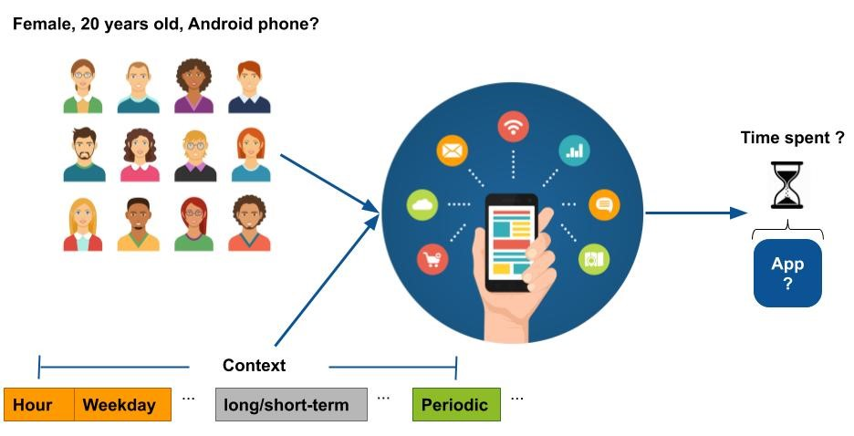

**Tian, Yuan**, Ke Zhou and Dan Pelleg. "What and How Long: Prediction of Mobile App Engagement." ACM Transactions on Information Systems (TOIS). (2021). To appear. 

Abstract
======

User engagement is crucial to the long-term success of a mobile app. Several metrics, such as dwell time, have been used for measuring user engagement. However, how to effectively predict user engagement in the context of mobile apps is still an open research question. For example, do the mobile usage contexts (e.g.,~time of day) in which users access mobile apps impact their dwell time? Answers to such questions could help mobile operating system and publishers to optimize advertising and service placement. In this paper, we first conduct an empirical study for assessing how user characteristics, temporal features, and the short/long-term contexts contribute to gains in predicting users' app dwell time on the population level. The comprehensive analysis is conducted on large app usage logs collected through a mobile advertising company. The dataset covers more than 12K anonymous users and 1.3 million log events. Based on the analysis, we further investigate a novel mobile app engagement prediction problem --  can we predict simultaneously what app the user will use next and how long he/she will stay on that app? We propose several strategies for this joint prediction problem and demonstrate that our model can improve the performance significantly when compared with the state-of-the-art baselines. Our work can help mobile system developers in designing a better and more engagement-aware mobile app user experience.

